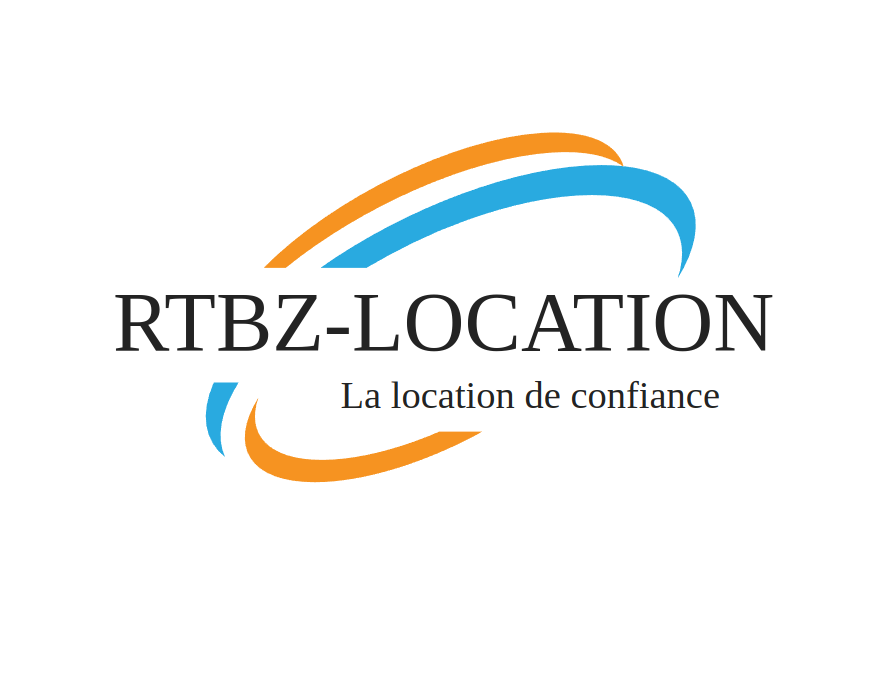

# SAE23

Tableau de bord :

CM = groupe + sujet
TP1 = bha tp1
TD1 = juste le git
TD2 = logo + cahier des charges

------

## Cahier des charges

On souhaite réaliser une application web pour une entreprise de location d'engins nommer RTBZ-Location ('La location de confiance'). Notre site comprendra, une page de connexion pour les clients, qui leur permettra de réaliser des locations de matérielles et de voir leur historique. Une autre page de connexion pour les administrateurs afin de gérer les clients et le matérielle.

Notre magnifique :

------

## Description de BDD

- Base client :
  - ID
  - Nom
  - Prénom
  - Tel
  - Adresse
  - Nombre de près en coure
  - Matérielle en coure de loc
- Base matérielle :
  - Type (voiture, ...)
  - Description
  - Prix
  - Stoque disponible
- Base pour les connexions sur le site :
  - Surnom
  - ID
  - MDP
- Base avec les prix / près :
  - Près en cours
  - Prix
  - Statuts
  - ID

Sur le site :

- Partie client :
  - Voir leurs prés
  - Faire des prés
  - Voir la matérielle dispo, et leur prix
- Partie admin :
  - Voir tous les clients
  - Et les administrer
  - Voir le matérielle et pouvoir le géré

------

## Les logs

