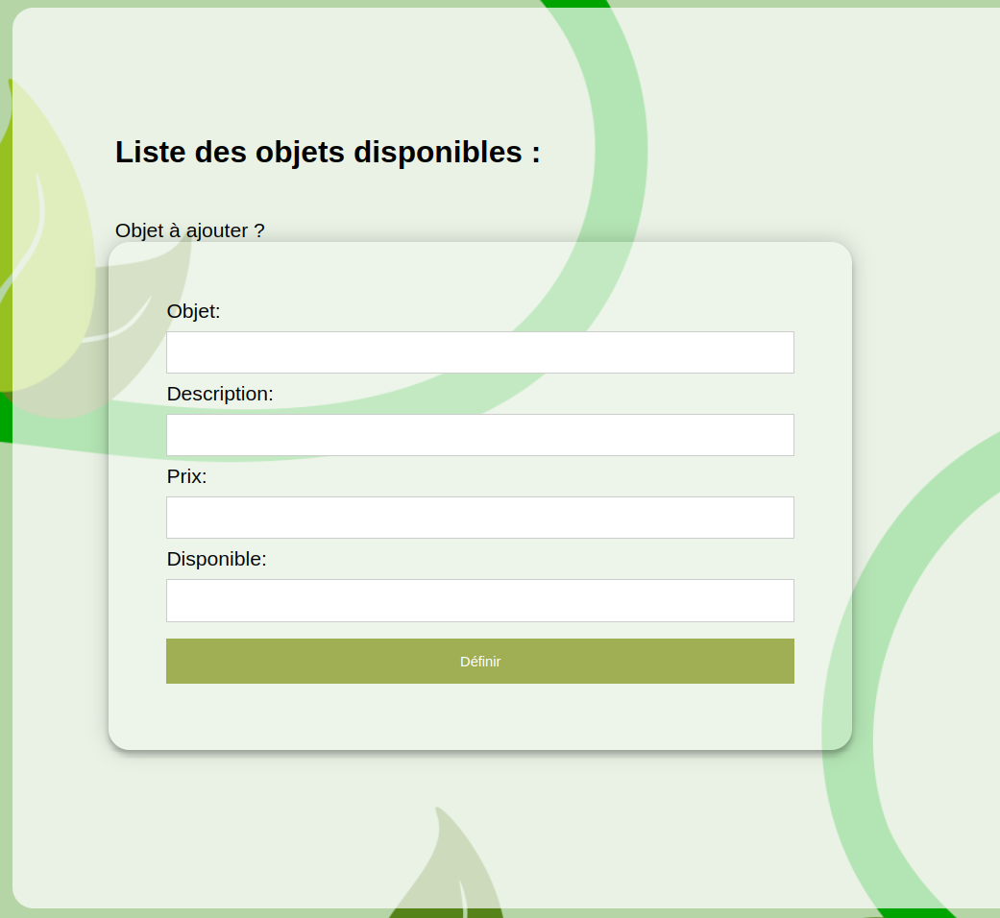
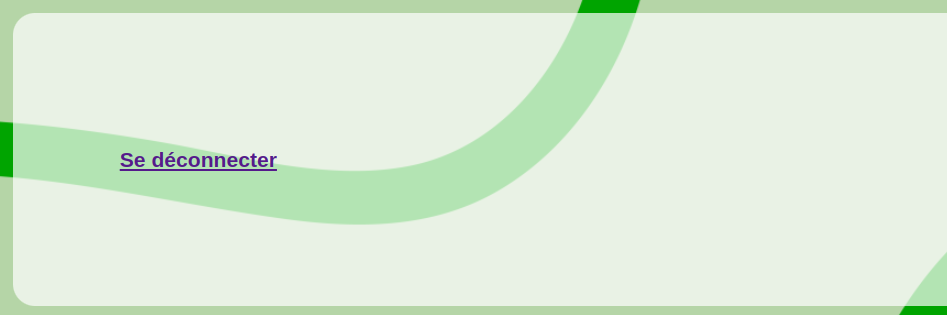

# SAE 23

Livrable de La SAE23 Comportant le Tutoriel d’installation et d’utilisation et une Démonstration technique.

-------
-------

## Table des matières :

## Tutoriel d’installation et d’utilisation

1. Notre solution semi-automatisée clé en main
2. Installation sur un serveur type plug and play
   1. mise en place de la BDD
   2. mise en place du PHP
   3. configuration de config-db.php

3. Une fois installer : Notre tutoriel d'utilisation
   1. L'inscription
   2. La connexion
   3. Le tableau de location
   4. Le tableau historique et location en cours
   5. Le Panelle d'administration
      1. Le tableau administration des clients.
      2. Le tableau historique et location en cours
   6. La déconnexion

## Démonstration technique

1. Vidéo
2. Commentaire avec marqueurs de temps

-------
-------

## 1 

Notre solution et une solution clé-en-main toute automatisée. Vous pourrez louer, mettre en location et gérer vos clients depuis une seule application web.

## 2 

L'installation d'une notre solution peut être effectuée sur un serveur de type Plug and Play comme le fameux serveur borelly.net que nous allons utiliser ici comme exemple.

Tout d'abord, on va mettre en place la base de données.

## 2.1

Pour cela rien de plus simple. On se connecte sur notre serveur phpMyAdmin.

Ensuite, dans import, on choisit notre fichier puis il ne reste plus qu'à appuyer sur GO pour finir l'importation de notre base de données.

Une fois la base de données en place on peut mettre en place le PHP.

## 2.2

Pour mettre en place le PHP il suffit simplement d'utiliser un outil tel que Filezilla pour se connecter à notre serveur distant et pouvoir envoyer nos fichiers. Dans notre cas (pour borelly.net) on ajoute en premier temps la clé RSA sur notre ordinateur puis on lance le logiciel Filezilla. Une fois sur le logiciel on rentre l'Hôte, soit dans notre cas l'IP suivante : 194.199.227.110, puis l'utilisateur qui nous est dédié et enfin toujours dans votre cas on met comme fort le numéro 22.

Une fois connecté au serveur avec Filezilla il nous suffira juste de glisser-déposer tous les fichiers dont nous avons besoin (index.PHP, css,...). Maintenant que notre PHP et en ligne il ne nous reste plus qu'à configurer le moyen de relier le site et la base de données.

## 2.3

Pour relier le site à la base de données il nous suffit de modifier le fichier de configuration config-db.php où il nous suffira d'entrer
le  nom de la base de données, le nom d'utilisateur et le mot de passe. 

Une fois ces trois étapes réalisées, l'installation de l'application Web est terminée !

## 3 

Maintenant que l'application est installée, on peut maintenant commencer à l'utiliser. Pour cela voici notre tutoriel d'utilisation : 

## 3.1

En premier lieu comme vous pouvez le voir quand vous arrivez sur le site, vous verrez une brève description de votre entreprise et en bas de la page un onglet de connexion. 

Ici vous pouvez réaliser deux actions : tout d'abord, l'inscription où en cliquant sur le bouton, un formulaire d'inscription s'affichera. Vous pourrez donc vous inscrire ici.

## 3.2

Une fois inscrit donc, vous pouvez vous connecter en entrant votre utilisateur et votre votre mot de passe en cliquant sur Connexion.

## 3.3

Une fois connecté vous serez redirigé vers une autre page avec un premier temps un tableau où on pourrait voir les locations de disponibles, par exemple ici la grue.

## 3.4

En dessous du tableau de location vous verrez un tableau des locations en cours et un historique de vos anciennes locations. Ici se termine la partie utilisateur.

## 3.5.1

Maintenant du côté administration, (default : admin // admin1234) on peut modifier les stocks disponibles et ajouter d'autres engins à la location. 

En bas de la page se trouve un bouton nommé panel d'administration où on pourra trouver un tableau permettant l'administration des clients.

## 3.5.2

Puis en dessous, un panneau d'administration dédié aux locations passées et en cours.

## 3.6

Pour finir en bas de chaque page que ce soit côté client ou côté administration, il y a un onglet de connexion pour se déconnecter.

Ou 

